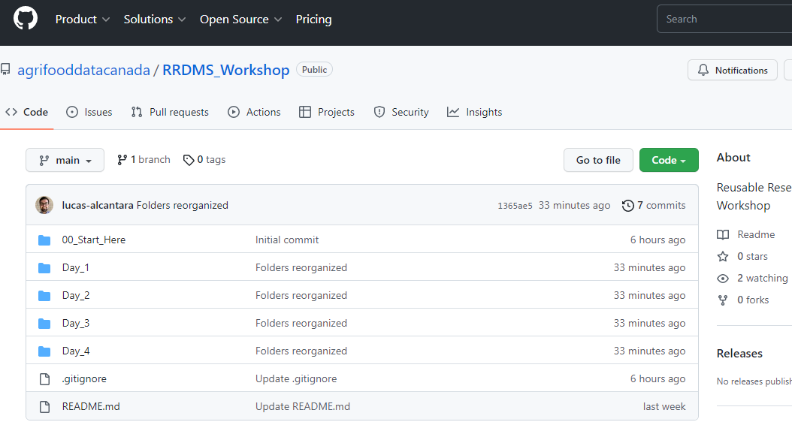
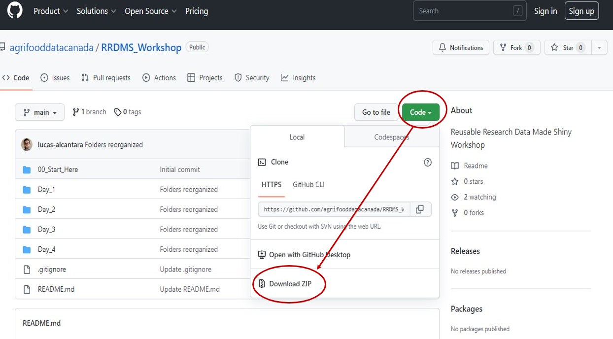
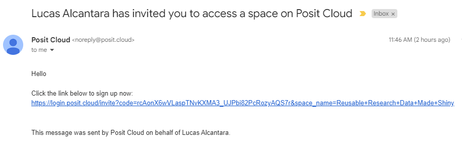
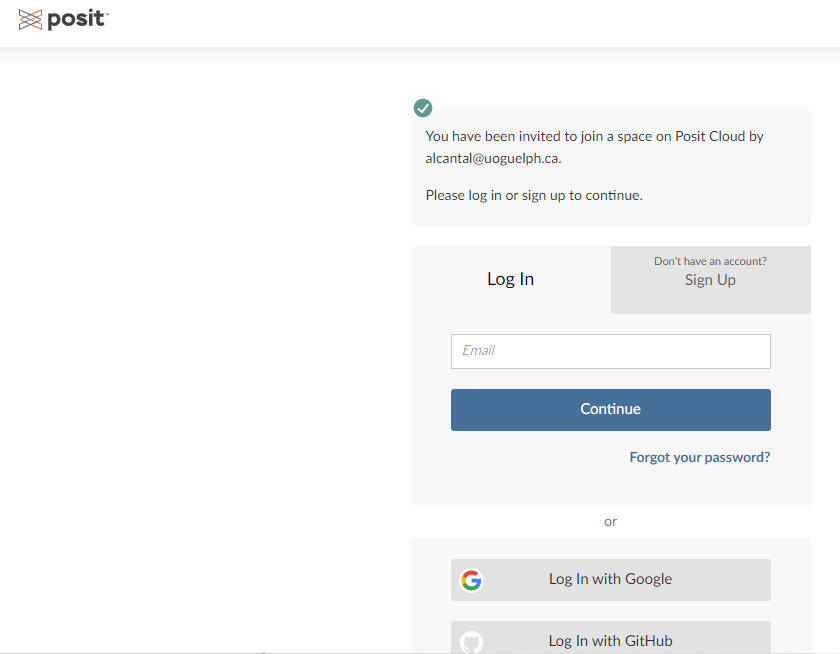
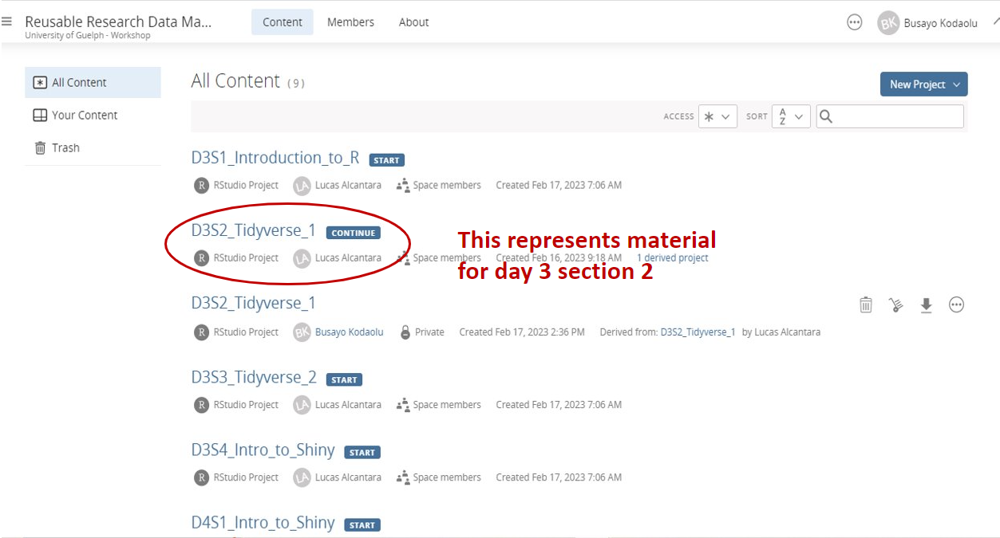
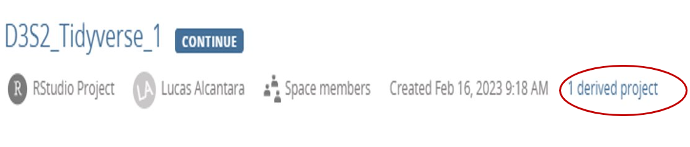
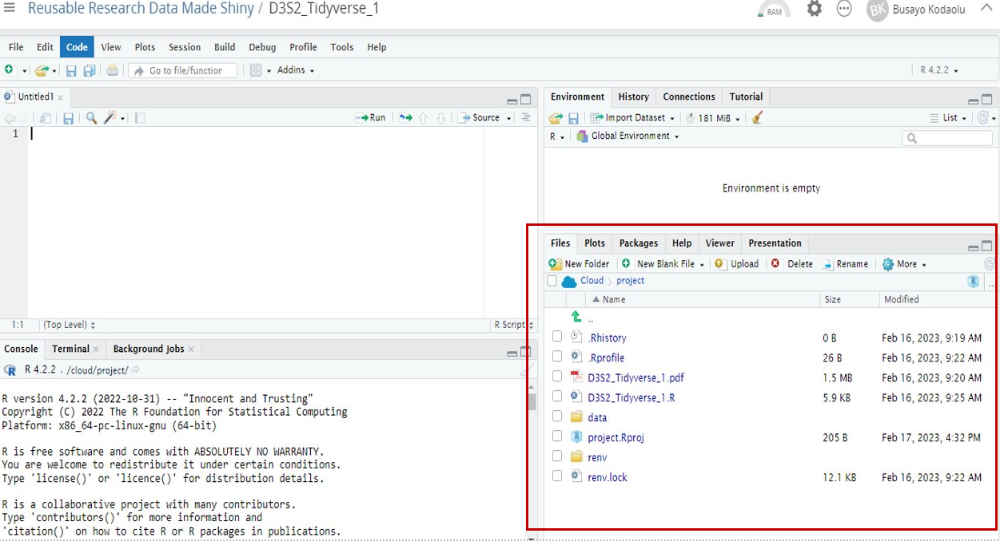
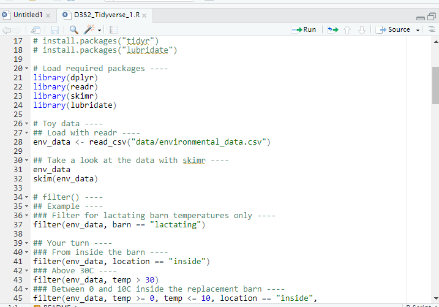
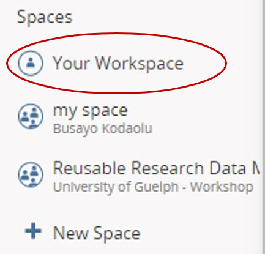

# How to get started on this Workshop
## GitHub and Posit Cloud
By  Busayo Kodaolu

2023-02-17

# Navigating Github

Okay, I know it sounds too "techy". To keep it simple, developers use GitHub to share codes, collaborate and keep track of changes to their codes. In this workshop, we are using it as a repository to share the workshop materials. Click [here](https://github.com/agrifooddatacanada/RRDMS_Workshop) to access the materials and you should see a screen like the one below:   
 

 

## Workshop Materials
Each folder contains the materials for a particular day. To download all the materials, click on the **green 'code' button**  and then **Download ZIP**

 

 

**Note**: The folders may not be fully populated by the time your are reading this. The materials will be loaded at some point before the workshop.

# Posit Cloud

## What is Posit Cloud?
Posit Cloud, formerly called RStudio cloud, is the RStudio IDE hosted in the cloud. This means you get to do your data analysis online, directly from your browser! There is no need to go through the process of downloading R and RStudio Desktop to your local computer. I think this is a very neat and convenient way to jump right into your work. Teaching data science courses or workshop hasn't been easier! It brings the classroom experience without having to be in the class physically. I will explain this later.

 

## How do you set-up Posit Cloud?
### Check your email

You will receive an invitation on the email address you used to register for the workshop, as shown below. You can safely click on the link within to access Posit Cloud:

 

 

### On your browser

The link will take you to a page that prompts you to either **log in** or **sign up** if you haven't registered for Posit Cloud (or RStudio Cloud) before.

 

 

## How to navigate the space

Once you are log in, you will be directed to the space where all the files for the workshop and packages have been pre-loaded and neatly arranged for you. After getting into the space, you see the project names and a blue tag showing its status. If you haven't clicked on it yet, it will show as START.  

 

  

After saving, it should show up as CONTINUE.

 

 

Remember I said earlier that an organization account is like a classroom? Yes, instructors can peep into your work and see your progress by clicking on **1 derived project**. That gives it the classroom kind of feeling when an instructor can easily help a student out! 

 

**Note**: Everyone have a role and limitations as to what they can do in a space. As a student, you will be added as a contributor, so only instructors and TAs can see and help you with your projects.

 

 

## Start a Workshop Project

Just click on one of the projects. For instance, the [**D3S2_Tidyverse_1**](https://posit.cloud/spaces/334748/content/5434494) takes your directly to the RStudio IDE, which is similar to RStudio Desktop version. You will see the pre-loaded files and scripts at the lower right hand corner. 

 

  

If you click on **D3S2_tidyverse_1.pdf**, it opens the slides for that workshop session.

 

 

And the **D3S2_tidyverse_1.R** opens the R script for the hands-on exercise.

 

 

## Start a Personal Project

Everyone that signs up to Posit Cloud gets a personal account i.e., Your Workspace. It isn't as complicated as it sounds. Think of it as your personal office space you get to do your personal work but can also invite people in to collaborate. The guest can work temporarily in Your Workspace, but they have to go to their own space eventually. To go to Your Workspace, click on the navigation side bar and follow the steps below to create a project in Your Workspace. 

### **Step 1** - Go to Your Workspace
Click on **Your Workspace**
 

 

You will see the following screen:

 

 

### **Step 2** - Create a New Project
Click **New Project** on the top-right corner, and then on **New RStudio Project**.

 

This will take you directly into the RStudio IDE, as shown below:

 

 

Remember, you are the only one that can work in your personal Workspace. Although you can invite people to collaborate, they can't make changes to the file. They have access to a temporary copy of your project, so they have to save a permanent copy to their own Workspace. To share content from Your Workspace,  

1. Click on the gear in the upper-right corner
2. Select the Access panel 
3. Set the access to everyone
4. You can now share the public link

 

 

**We are excited to have you at the workshop :)**
